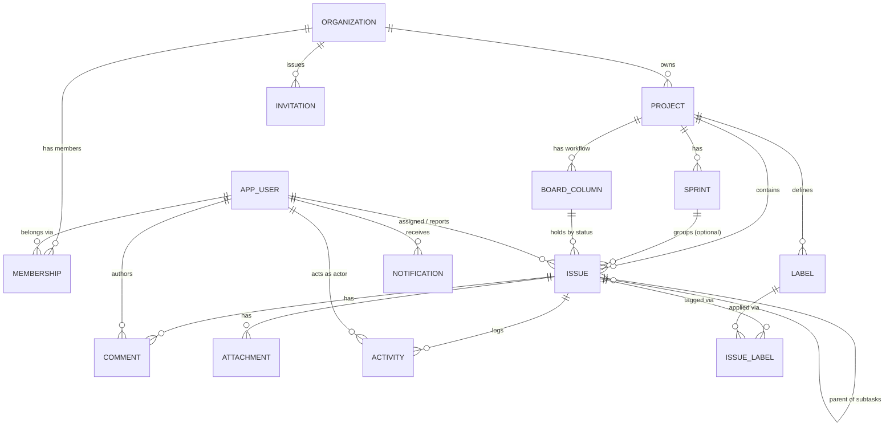
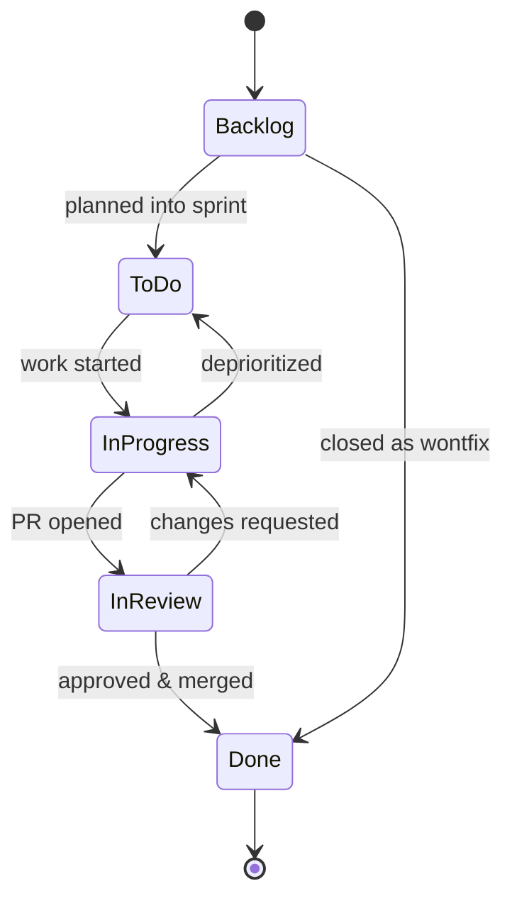
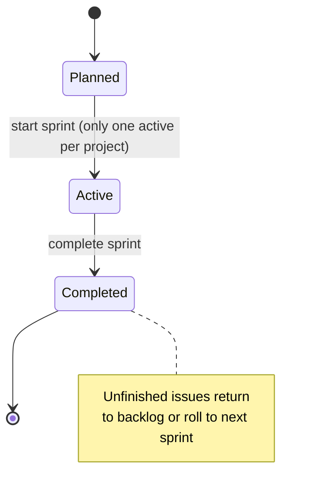
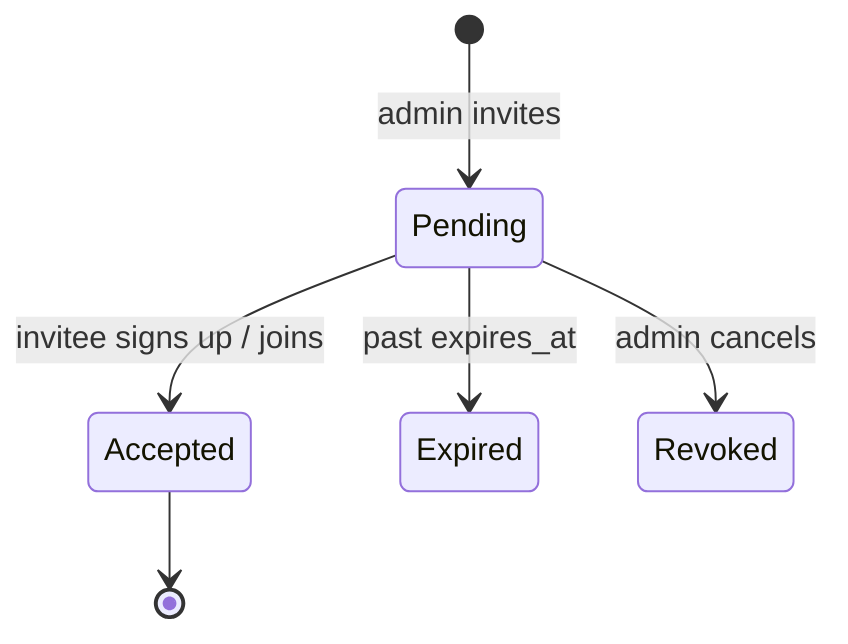
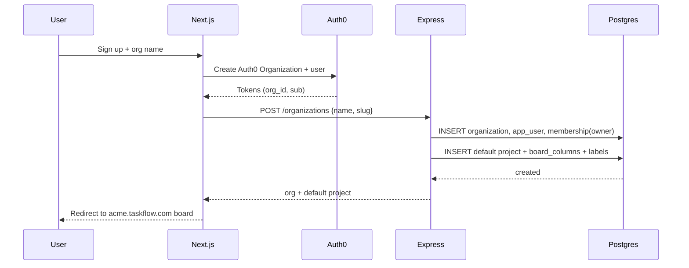
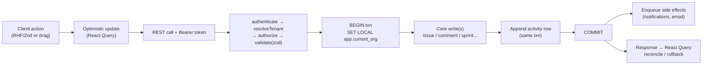

# TaskFlow — Data Model, Entities & Data Flow

**Companion to `taskflow-system-design.md`. Detailed entity attributes, relationships, interactions, user journeys, and data flows.**

| | |
|---|---|
| **Author** | Pradip Singh |
| **Status** | Draft v1.0 |
| **Date** | 2026-07-17 |

---

## 1. How to read this document

This document zooms in on **data**: every entity, every attribute (with type, constraints, and meaning), how the entities relate, and how data moves through the system when users act. It assumes the architecture in `taskflow-system-design.md` (multi-tenant, shared-schema Postgres with RLS, Express API, Next.js frontend, Auth0).

Two invariants apply to *every* tenant-scoped entity below:

1. It carries an `organization_id` that scopes it to exactly one tenant.
2. It is only ever read/written inside a transaction where `SET LOCAL app.current_org` is set, so Postgres RLS guarantees isolation.

---

## 2. Entity relationship overview



**Reading the cardinalities:** `||--o{` means "one to zero-or-many". One organization has many memberships; one issue has many comments; a user can be assigned many issues. `MEMBERSHIP` and `ISSUE_LABEL` are join tables that resolve many-to-many relationships (users↔orgs, issues↔labels).

---

## 3. Entity catalog (detailed attributes)

Legend for constraints: **PK** primary key · **FK** foreign key · **UQ** unique · **NN** not null · **IDX** indexed · **DEF** default.

### 3.1 `organization` — the tenant

The root of every data partition. Everything else hangs off an organization.

| Attribute | Type | Constraints | Description |
|---|---|---|---|
| `id` | UUID | PK, DEF `gen_random_uuid()` | Internal tenant identifier used everywhere as `organization_id`. |
| `auth0_org_id` | TEXT | UQ, NN | Links to the Auth0 Organization; how tokens map to this tenant. |
| `name` | TEXT | NN | Display name, e.g. "Acme Inc". |
| `slug` | TEXT | UQ, NN | Subdomain, e.g. `acme` → `acme.taskflow.com`. Lowercase, URL-safe. |
| `plan` | TEXT | NN, DEF `'free'` | Billing tier placeholder (`free`/`pro`) — future use. |
| `created_at` | TIMESTAMPTZ | NN, DEF `now()` | Provisioned timestamp. |

*Not tenant-scoped by RLS itself — it **is** the tenant. Access is gated by membership.*

### 3.2 `app_user` — global identity

One row per real person, shared across all orgs they belong to. Deliberately **not** tenant-scoped, because a single account can be a member of many organizations.

| Attribute | Type | Constraints | Description |
|---|---|---|---|
| `id` | UUID | PK, DEF `gen_random_uuid()` | Internal user id. |
| `auth0_user_id` | TEXT | UQ, NN | Subject (`sub`) from the Auth0 token. |
| `email` | TEXT | NN, IDX | Primary email (from Auth0 profile). |
| `name` | TEXT | | Display name. |
| `avatar_url` | TEXT | | Profile picture URL. |
| `created_at` | TIMESTAMPTZ | NN, DEF `now()` | First-seen timestamp. |

### 3.3 `membership` — user ↔ org with a role

Join table that also carries the RBAC role. This is what makes a user "part of" an org.

| Attribute | Type | Constraints | Description |
|---|---|---|---|
| `id` | UUID | PK | |
| `organization_id` | UUID | FK→organization, NN, IDX | The tenant. |
| `user_id` | UUID | FK→app_user, NN | The member. |
| `role` | TEXT | NN, CHECK in (`owner`,`admin`,`member`,`viewer`) | RBAC role within this org. |
| `status` | TEXT | NN, DEF `'active'` | `active` / `suspended`. |
| `created_at` | TIMESTAMPTZ | NN, DEF `now()` | When they joined. |
| | | UQ (`organization_id`,`user_id`) | A user has at most one membership per org. |

### 3.4 `invitation` — pending membership

Tracks teammates invited but not yet joined. Backed by an Auth0 Organization invitation.

| Attribute | Type | Constraints | Description |
|---|---|---|---|
| `id` | UUID | PK | |
| `organization_id` | UUID | FK, NN, IDX | Tenant the invite is for. |
| `email` | TEXT | NN | Invitee's email. |
| `role` | TEXT | NN | Role to grant on acceptance. |
| `invited_by` | UUID | FK→app_user, NN | Who sent it. |
| `token` | TEXT | UQ, NN | Opaque acceptance token (from Auth0). |
| `status` | TEXT | NN, DEF `'pending'` | `pending`/`accepted`/`expired`/`revoked`. |
| `expires_at` | TIMESTAMPTZ | NN | Expiry. |
| `created_at` | TIMESTAMPTZ | NN, DEF `now()` | |

### 3.5 `project`

A container for work within an org.

| Attribute | Type | Constraints | Description |
|---|---|---|---|
| `id` | UUID | PK | |
| `organization_id` | UUID | FK, NN, IDX | Owning tenant. |
| `key` | TEXT | NN, UQ per org | Short prefix, e.g. `MOB` → issues `MOB-1`, `MOB-2`. |
| `name` | TEXT | NN | e.g. "Mobile App". |
| `description` | TEXT | | Optional summary. |
| `lead_id` | UUID | FK→app_user | Project lead. |
| `issue_counter` | INT | NN, DEF `0` | Last used issue `number` for this project (drives sequential numbering). |
| `archived` | BOOLEAN | NN, DEF `false` | Soft-archive flag. |
| `created_at` | TIMESTAMPTZ | NN, DEF `now()` | |
| | | UQ (`organization_id`,`key`) | Keys unique within a tenant. |

### 3.6 `board_column` — workflow states

Defines the Kanban columns and the ordered set of valid statuses for a project.

| Attribute | Type | Constraints | Description |
|---|---|---|---|
| `id` | UUID | PK | |
| `organization_id` | UUID | FK, NN | Tenant. |
| `project_id` | UUID | FK→project, NN, IDX | Owning project. |
| `name` | TEXT | NN | Display label, e.g. "In Progress". |
| `status_key` | TEXT | NN | Machine value stored on `issue.status`, e.g. `in_progress`. |
| `category` | TEXT | NN | `todo`/`in_progress`/`done` — used for reporting. |
| `position` | INT | NN | Left-to-right column order. |
| `wip_limit` | INT | | Optional work-in-progress cap. |
| | | UQ (`project_id`,`status_key`) | One column per status per project. |

### 3.7 `sprint`

A time-boxed iteration (optional per project).

| Attribute | Type | Constraints | Description |
|---|---|---|---|
| `id` | UUID | PK | |
| `organization_id` | UUID | FK, NN | Tenant. |
| `project_id` | UUID | FK→project, NN, IDX | Owning project. |
| `name` | TEXT | NN | e.g. "Sprint 12". |
| `goal` | TEXT | | Sprint objective. |
| `state` | TEXT | NN, DEF `'planned'`, CHECK in (`planned`,`active`,`completed`) | Lifecycle. |
| `start_date` | TIMESTAMPTZ | | Set when started. |
| `end_date` | TIMESTAMPTZ | | Planned/actual end. |
| `created_at` | TIMESTAMPTZ | NN, DEF `now()` | |

*Rule: at most one `active` sprint per project at a time.*

### 3.8 `issue` — the atomic unit of work

The richest entity; the center of almost every interaction.

| Attribute | Type | Constraints | Description |
|---|---|---|---|
| `id` | UUID | PK | Stable internal id. |
| `organization_id` | UUID | FK, NN, IDX | Tenant. |
| `project_id` | UUID | FK→project, NN, IDX | Owning project. |
| `sprint_id` | UUID | FK→sprint, NULL | Current sprint, or null (backlog). ON DELETE SET NULL. |
| `number` | INT | NN | Per-project sequential (renders as `MOB-42`). |
| `title` | TEXT | NN | Summary line. |
| `description` | TEXT | | Rich text / markdown body. |
| `type` | TEXT | NN, DEF `'task'`, CHECK in (`task`,`bug`,`story`,`epic`) | Issue type. |
| `status` | TEXT | NN, DEF `'backlog'` | Matches a `board_column.status_key`. |
| `priority` | TEXT | NN, DEF `'medium'`, CHECK in (`low`,`medium`,`high`,`urgent`) | Priority. |
| `story_points` | INT | | Estimate (Fibonacci-ish). |
| `position` | DOUBLE PRECISION | NN, DEF `0` | Fractional order within its column (avoids full renumber on reorder). |
| `assignee_id` | UUID | FK→app_user, NULL | Who owns the work. ON DELETE SET NULL. |
| `reporter_id` | UUID | FK→app_user, NN | Who created it. |
| `parent_id` | UUID | FK→issue, NULL | Parent issue for sub-tasks. ON DELETE SET NULL. |
| `due_date` | TIMESTAMPTZ | | Optional deadline. |
| `created_at` | TIMESTAMPTZ | NN, DEF `now()` | |
| `updated_at` | TIMESTAMPTZ | NN, DEF `now()` | Bumped on every edit. |
| | | UQ (`project_id`,`number`) | Human-readable key uniqueness. |
| | | IDX (`organization_id`,`project_id`,`status`) | Fast board queries. |

### 3.9 `label` and `issue_label`

Reusable tags scoped to a project, applied to issues many-to-many.

**`label`**

| Attribute | Type | Constraints | Description |
|---|---|---|---|
| `id` | UUID | PK | |
| `organization_id` | UUID | FK, NN | Tenant. |
| `project_id` | UUID | FK→project, NN, IDX | Owning project. |
| `name` | TEXT | NN | e.g. "backend", "urgent". |
| `color` | TEXT | NN | Hex/token for the chip. |
| | | UQ (`project_id`,`name`) | Unique per project. |

**`issue_label`** (join)

| Attribute | Type | Constraints | Description |
|---|---|---|---|
| `issue_id` | UUID | FK→issue, NN | |
| `label_id` | UUID | FK→label, NN | |
| `organization_id` | UUID | FK, NN | Carried so RLS applies to the join table too. |
| | | PK (`issue_id`,`label_id`) | |

### 3.10 `comment`

Discussion on an issue.

| Attribute | Type | Constraints | Description |
|---|---|---|---|
| `id` | UUID | PK | |
| `organization_id` | UUID | FK, NN | Tenant. |
| `issue_id` | UUID | FK→issue, NN, IDX | Parent issue. |
| `author_id` | UUID | FK→app_user, NN | Commenter. |
| `body` | TEXT | NN | Markdown; may contain `@mentions`. |
| `mentions` | UUID[] | DEF `'{}'` | Mentioned user ids (drives notifications). |
| `created_at` | TIMESTAMPTZ | NN, DEF `now()` | |
| `updated_at` | TIMESTAMPTZ | NN, DEF `now()` | |

### 3.11 `attachment`

File metadata; the binary lives in object storage (S3-compatible).

| Attribute | Type | Constraints | Description |
|---|---|---|---|
| `id` | UUID | PK | |
| `organization_id` | UUID | FK, NN | Tenant. |
| `issue_id` | UUID | FK→issue, NN, IDX | Parent issue. |
| `uploaded_by` | UUID | FK→app_user, NN | Uploader. |
| `filename` | TEXT | NN | Original name. |
| `content_type` | TEXT | NN | MIME type. |
| `size_bytes` | BIGINT | NN | File size. |
| `storage_key` | TEXT | NN | Object storage path. |
| `created_at` | TIMESTAMPTZ | NN, DEF `now()` | |

### 3.12 `activity` — audit / history feed

Append-only record of what happened to an issue. Powers the activity feed and audit trail.

| Attribute | Type | Constraints | Description |
|---|---|---|---|
| `id` | UUID | PK | |
| `organization_id` | UUID | FK, NN | Tenant. |
| `issue_id` | UUID | FK→issue, NN, IDX | Subject issue. |
| `actor_id` | UUID | FK→app_user, NN | Who did it. |
| `verb` | TEXT | NN | `created`,`moved`,`assigned`,`commented`,`labeled`,`updated`… |
| `meta` | JSONB | NN, DEF `'{}'` | Structured detail, e.g. `{"from":"todo","to":"done"}`. |
| `created_at` | TIMESTAMPTZ | NN, DEF `now()`, IDX | Chronology. |

*Never updated or deleted — append-only.*

### 3.13 `notification`

Per-user inbox items (mentions, assignments).

| Attribute | Type | Constraints | Description |
|---|---|---|---|
| `id` | UUID | PK | |
| `organization_id` | UUID | FK, NN | Tenant. |
| `recipient_id` | UUID | FK→app_user, NN, IDX | Who receives it. |
| `type` | TEXT | NN | `mention`,`assigned`,`comment`,`due_soon`. |
| `issue_id` | UUID | FK→issue, NULL | Related issue. |
| `payload` | JSONB | NN, DEF `'{}'` | Render data. |
| `read_at` | TIMESTAMPTZ | NULL | Null = unread. |
| `created_at` | TIMESTAMPTZ | NN, DEF `now()` | |

---

## 4. How the entities interact

A few narratives that tie the schema together:

**An organization is a wall around everything.** Projects, issues, labels, sprints, comments, and activity all carry `organization_id`. Delete an organization and everything cascades. No query ever crosses that wall because RLS filters on the per-request org context.

**Users are global; membership is local.** `app_user` exists once per person. Their relationship to a tenant — and their power within it — lives entirely in `membership.role`. The same person can be an `admin` in Acme and a `viewer` in Globex; the role that applies is whichever org the current token/subdomain resolves to.

**Projects own their own workflow.** `board_column` rows define the legal `status` values for a project's issues. An issue's `status` is always one of its project's `status_key`s. This lets each project customize its board without a global enum.

**Issues are the hub.** They connect to a project (always), a sprint (optionally), an assignee and reporter (users), a parent issue (for sub-tasks), labels (many-to-many via `issue_label`), comments, attachments, and a stream of activity. Almost every user action ultimately reads or writes an issue and appends an `activity` row.

**Activity is the connective history.** Nearly every mutation writes an `activity` row in the *same transaction* as the change itself, so the audit trail can never drift from reality. Moving a card = update `issue.status` + insert `activity(verb='moved')` atomically.

**Notifications are derived side effects.** When a comment mentions someone or an issue is assigned, the service enqueues `notification` rows (and optionally emails) for the affected users — done after the core write, ideally via the background queue.

---

## 5. Entity lifecycles (state machines)

### 5.1 Issue status flow

Statuses come from the project's board columns; a typical default workflow:



Each transition updates `issue.status` and appends `activity(verb='moved', meta:{from,to})`. Transitions are not hard-restricted in v1 (any column → any column via drag), but the diagram shows the intended happy path.

### 5.2 Sprint state flow



### 5.3 Invitation flow



---

## 6. User interactions & data flows

Each subsection: **who** does it, **what** happens in the UI, **which** entities are touched, and the **data flow**.

### 6.1 Sign up & create an organization

**Actor:** a new user (becomes Owner).

1. User authenticates via Auth0 Universal Login; on first login the app creates an Auth0 Organization + an `organization` row and an `app_user` row.
2. A `membership` row is created with `role='owner'`.
3. The backend seeds a default `project`, its default `board_column` set (Backlog/To Do/In Progress/In Review/Done), and a starter `label` set.



**Entities written:** `organization`, `app_user`, `membership`, `project`, `board_column`, `label`.

### 6.2 Invite a teammate

**Actor:** Owner/Admin.

1. Admin enters an email + role in the Members screen.
2. API creates an Auth0 invitation and an `invitation` row (`status='pending'`).
3. Invitee clicks the emailed link, authenticates; on acceptance a `membership` row is created and the invitation flips to `accepted`.

**Entities:** `invitation` → `membership` (+ `app_user` if new).

### 6.3 Create an issue

**Actor:** Member+.

1. User opens the "New issue" modal (React Hook Form + shared Zod schema).
2. On submit, `POST /projects/:id/issues`. The service, in one transaction: increments `project.issue_counter` → assigns `number`, inserts the `issue`, links any `issue_label` rows, appends `activity(verb='created')`.
3. If an assignee was set, enqueue a `notification` (type `assigned`).

```mermaid
sequenceDiagram
    participant U as User
    participant W as Next.js (RHF+Zod)
    participant API as Express
    participant DB as Postgres

    U->>W: Fill issue form, submit
    W->>W: Client-side Zod validation
    W->>API: POST /projects/:id/issues {title, type, assigneeId, labelIds...}
    API->>API: validate(zod) + authorize(issue:write)
    API->>DB: BEGIN; SET LOCAL app.current_org
    API->>DB: UPDATE project SET issue_counter+1 RETURNING number
    API->>DB: INSERT issue (number, ...)
    API->>DB: INSERT issue_label[]
    API->>DB: INSERT activity(verb='created')
    API->>DB: COMMIT
    API-->>W: 201 issue (MOB-42)
    W->>W: React Query cache update
    API--)DB: enqueue notification (assigned)
```

**Entities:** `project` (counter), `issue`, `issue_label`, `activity`, `notification`.

### 6.4 Move a card on the board (drag-and-drop)

**Actor:** Member+. The signature interaction.

1. User drags a card between columns. React Query applies an **optimistic** board update instantly.
2. `PATCH /issues/:id/move {status, position}` fires.
3. Service, in one transaction: updates `issue.status` + `issue.position`, appends `activity(verb='moved', meta:{from,to})`.
4. On success, React Query reconciles; on error, it rolls back to the previous board.

**Entities:** `issue` (status, position), `activity`. See `taskflow-system-design.md` §10 for the full sequence diagram.

### 6.5 Comment with a mention

**Actor:** any member who can comment.

1. User posts a comment; `@names` are parsed into `mentions` (user ids).
2. `POST /issues/:id/comments` inserts the `comment` and appends `activity(verb='commented')` in one transaction.
3. For each mentioned user, enqueue a `notification` (type `mention`).

**Entities:** `comment`, `activity`, `notification`.

### 6.6 Plan and run a sprint

**Actor:** Admin/Member.

1. In the backlog, user drags issues into a sprint → sets `issue.sprint_id`.
2. Start sprint → `sprint.state='active'`, `start_date=now()` (guard: no other active sprint in the project).
3. Complete sprint → `sprint.state='completed'`; unfinished issues return to backlog (`sprint_id=null`) or roll into the next sprint.
4. Burndown reads `activity` "done" transitions over the sprint window.

**Entities:** `sprint`, `issue` (sprint_id, status), `activity`.

### 6.7 Filter / search the board

**Actor:** any member.

1. User sets filters (assignee, label, priority, sprint, text query). Active filters live in **URL search params + Zustand**.
2. `GET /projects/:id/issues?status=&assignee=&label=&q=&cursor=` returns a cursor-paginated, RLS-scoped set.
3. React Query caches per filter combination; changing filters refetches.

**Entities read:** `issue` (+ joined `issue_label`, `app_user`).

### 6.8 View dashboard

**Actor:** any member.

`GET /projects/:id/stats` returns server-side aggregations — issues by status/assignee/priority, velocity, overdue count — computed with grouped queries (optionally cached in Redis). Rendered as charts.

**Entities read:** `issue`, `activity`, `sprint`.

---

## 7. Data flow summary (write path)

Every mutating request follows the same shape, which is why the model stays consistent:



The two rules that keep data trustworthy: **(1)** the core change and its `activity` record commit together, and **(2)** the whole thing runs under the tenant's RLS context so it can only ever touch one organization's rows.

---

## 8. Cross-cutting attribute conventions

- **Identifiers:** all PKs are UUIDs. Issues additionally expose a human key `PROJECT_KEY-number` (e.g. `MOB-42`) derived from `project.key` + `issue.number`.
- **Timestamps:** always `TIMESTAMPTZ` in UTC; `created_at` on everything, `updated_at` on mutable entities.
- **Ordering:** `position` is a `DOUBLE PRECISION` so a card dropped between two others gets the midpoint value — no bulk renumbering.
- **Soft vs hard delete:** projects use `archived` (soft); issues/comments are hard-deleted but their `activity` history (which references `issue_id`) is retained where possible for audit.
- **Tenancy:** `organization_id` is present and indexed on every tenant-scoped table, including join tables, because RLS policies are applied uniformly.

---

*End of document.*
