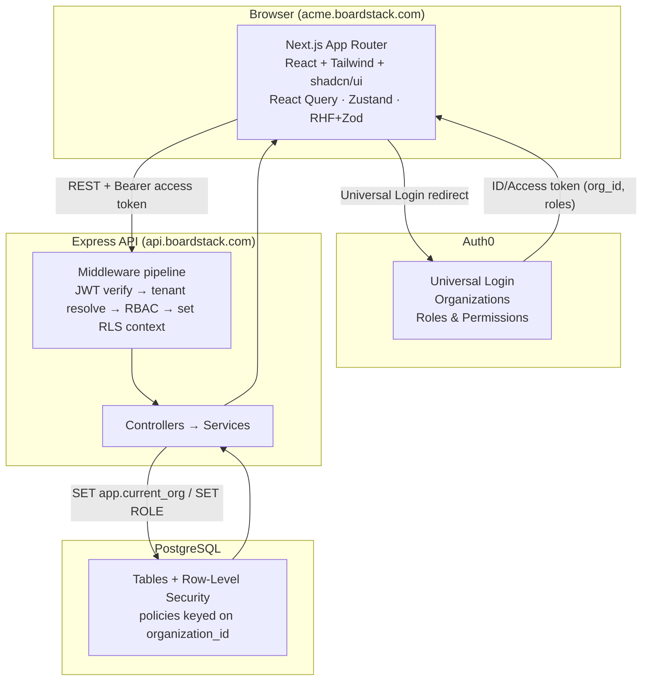
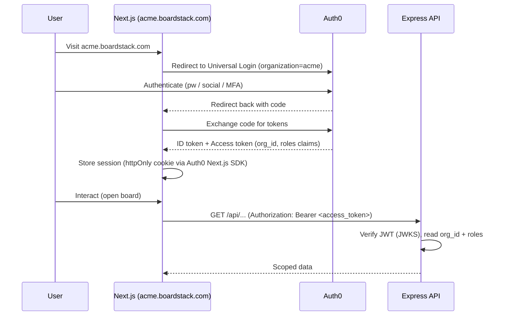
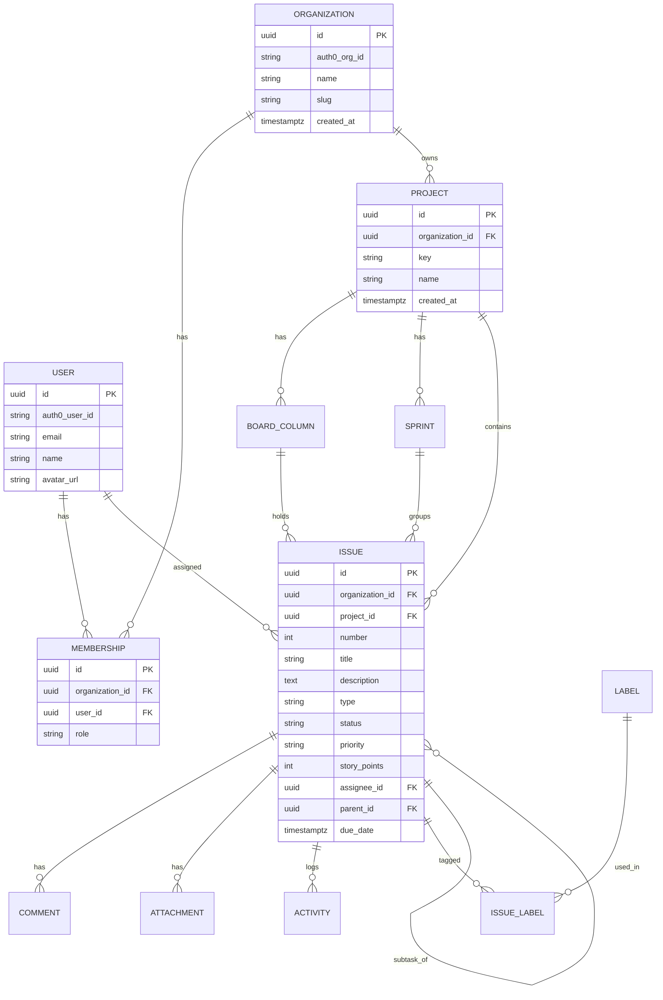

# Boardstack — System Design Document

**A multi-tenant project & task management SaaS (Jira/Linear-lite)**

| | |
|---|---|
| **Author** | Pradip Singh |
| **Status** | Draft v1.0 |
| **Date** | 2026-07-17 |
| **Repos** | `boardstack-web` (Next.js), `boardstack-api` (Express) |

---

## 1. Overview

Boardstack is a B2B SaaS where companies ("organizations") sign up, create workspaces, invite teammates, and manage work across projects using Kanban boards, issues, and sprints. Every organization's data is fully isolated from every other organization's — this multi-tenant isolation is the architectural core of the project.

The system is split into two independently deployable applications: a **Next.js frontend** and an **Express backend**, communicating over a versioned REST API. Authentication and organization membership are delegated to **Auth0** (using its native Organizations feature), and tenant data isolation is enforced at the database layer with **PostgreSQL Row-Level Security (RLS)**.

### 1.1 Goals

- Demonstrate production-grade multi-tenancy with defense-in-depth isolation.
- Exercise the full target stack: Next.js, React, Tailwind, shadcn/ui, React Hook Form, React Query, Node/Express, PostgreSQL, Docker, Zustand, Zod.
- Ship a genuinely usable product: boards, drag-and-drop, optimistic updates, RBAC, comments, activity feeds, sprints, and dashboards.
- Provide a clean, layered architecture that is easy to explain in interviews.

### 1.2 Non-goals (v1)

- Billing/payments (design leaves room for it, but it is out of scope).
- Native mobile apps.
- Real-time collaboration via WebSockets (polling/refetch is sufficient for v1; noted as a future enhancement).
- Self-hosted / on-prem distribution.

---

## 2. Tech stack

| Layer | Technology | Role |
|---|---|---|
| Frontend framework | **Next.js (App Router)** | Routing, server components, SSR shells |
| UI library | **React** | Component model |
| Styling | **Tailwind CSS** | Utility-first styling |
| Components | **shadcn/ui** | Accessible, themeable component primitives |
| Forms | **React Hook Form + Zod** | Form state + shared validation schemas |
| Server state | **React Query (TanStack Query)** | Caching, mutations, optimistic updates |
| Client/UI state | **Zustand** | Modals, filters, board interaction state |
| Backend | **Node.js + Express** | REST API, business logic |
| Validation | **Zod** | Request validation, shared types |
| Database | **PostgreSQL** | Persistent store + Row-Level Security |
| ORM/Query | **Prisma** (or Kysely) | Type-safe DB access |
| Auth | **Auth0 (Organizations)** | Authentication + org membership + RBAC |
| Containerization | **Docker + docker-compose** | Local dev + deployment parity |

> **Shared types:** Zod schemas live in a shared package (`packages/shared` in a monorepo, or a small published/internal lib) so the same validation and inferred TypeScript types are used on both client and server.

---

## 3. High-level architecture



The browser authenticates against Auth0 and receives an access token that carries the active organization (`org_id`) and the user's roles. Every API call to Express includes that token. Express verifies it, resolves and confirms the tenant, sets a per-request database session variable, and RLS enforces isolation on every query.

---

## 4. Multi-tenancy strategy

### 4.1 Isolation model — shared database, shared schema

All tenants share one database and one schema. Every tenant-scoped table carries an `organization_id` column, and PostgreSQL RLS policies ensure a query only ever sees rows belonging to the current organization.

**Why this model:** it is the most common real-world SaaS pattern, scales well, keeps migrations simple (one schema), and — most importantly — lets you showcase RLS, which is the strongest isolation story you can tell without over-engineering. Schema-per-tenant and database-per-tenant are documented as alternatives but not used.

| Model | Pros | Cons | Verdict |
|---|---|---|---|
| Shared DB, shared schema + RLS | Simple migrations, cost-efficient, scales, strong RLS story | Must be disciplined about `organization_id` | **Chosen** |
| Shared DB, schema-per-tenant | Stronger logical separation | Migration fan-out, connection complexity | Rejected |
| Database-per-tenant | Hardest isolation | Operationally heavy, overkill for portfolio | Rejected |

### 4.2 Tenant resolution — subdomain

Each organization gets a subdomain: `acme.boardstack.com`. The flow:

1. The Next.js app reads the subdomain from the host header (middleware) and knows which org the user intends to use.
2. On login, Auth0 issues a token scoped to a specific organization (`org_id` claim).
3. The Express API cross-checks: the `org_id` in the token must correspond to the subdomain the request came from, and the user must be a member. Mismatches are rejected (403).

### 4.3 Defense in depth

Isolation is enforced at three layers so a single mistake never leaks data:

1. **Auth token** — carries `org_id`; a user only receives tokens for orgs they belong to.
2. **Application middleware** — validates membership + role before any handler runs.
3. **Database RLS** — even a query missing a `WHERE organization_id = …` clause returns zero foreign rows, because the policy filters on a session variable set per request.

---

## 5. Authentication & authorization (Auth0)

### 5.1 Why Auth0 Organizations

Auth0's **Organizations** feature is purpose-built for B2B multi-tenant apps. Each Boardstack organization maps to an Auth0 Organization. Auth0 handles the hard parts — login UI, password reset, MFA, social login, invitations, and per-org membership — so the app's backend focuses on domain logic and data isolation.

### 5.2 Concepts mapping

| Boardstack concept | Auth0 concept |
|---|---|
| Organization (tenant) | Auth0 Organization |
| User account | Auth0 User |
| Membership in an org | Organization Member |
| Role (Owner/Admin/Member/Viewer) | Organization Roles + Permissions |
| Invite teammate | Auth0 Organization Invitation |

### 5.3 Login flow



- The frontend uses the **Auth0 Next.js SDK**; the session is stored in an httpOnly cookie, and the access token is attached to API calls.
- The backend validates the JWT against Auth0's JWKS endpoint (signature, `aud`, `iss`, expiry), then reads the `org_id` and `roles`/`permissions` claims.

### 5.4 Roles & RBAC

Four roles, checked on the backend per endpoint and reflected in the UI:

| Role | Capabilities |
|---|---|
| **Owner** | Everything, incl. delete org, manage billing, transfer ownership |
| **Admin** | Manage members, projects, labels, workflow settings |
| **Member** | Create/edit issues, comment, move cards, manage own work |
| **Viewer** | Read-only access to projects and issues |

Permissions are declared in Auth0 and surfaced as claims. Express uses a `requirePermission('issue:write')`-style middleware; the frontend hides or disables controls the current user lacks permission for (never the sole line of defense).

---

## 6. Data model

### 6.1 Entity-relationship diagram



### 6.2 Core tables (DDL sketch)

```sql
-- Organizations (tenants)
CREATE TABLE organization (
    id             UUID PRIMARY KEY DEFAULT gen_random_uuid(),
    auth0_org_id   TEXT UNIQUE NOT NULL,
    name           TEXT NOT NULL,
    slug           TEXT UNIQUE NOT NULL,          -- subdomain
    created_at     TIMESTAMPTZ NOT NULL DEFAULT now()
);

-- Global user identities (one per person)
CREATE TABLE app_user (
    id             UUID PRIMARY KEY DEFAULT gen_random_uuid(),
    auth0_user_id  TEXT UNIQUE NOT NULL,
    email          TEXT NOT NULL,
    name           TEXT,
    avatar_url     TEXT,
    created_at     TIMESTAMPTZ NOT NULL DEFAULT now()
);

-- Membership: a user's role within an org (many-to-many)
CREATE TABLE membership (
    id               UUID PRIMARY KEY DEFAULT gen_random_uuid(),
    organization_id  UUID NOT NULL REFERENCES organization(id) ON DELETE CASCADE,
    user_id          UUID NOT NULL REFERENCES app_user(id) ON DELETE CASCADE,
    role             TEXT NOT NULL CHECK (role IN ('owner','admin','member','viewer')),
    created_at       TIMESTAMPTZ NOT NULL DEFAULT now(),
    UNIQUE (organization_id, user_id)
);

CREATE TABLE project (
    id               UUID PRIMARY KEY DEFAULT gen_random_uuid(),
    organization_id  UUID NOT NULL REFERENCES organization(id) ON DELETE CASCADE,
    key              TEXT NOT NULL,                -- e.g. "MOB"
    name             TEXT NOT NULL,
    description      TEXT,
    lead_id          UUID REFERENCES app_user(id),
    created_at       TIMESTAMPTZ NOT NULL DEFAULT now(),
    UNIQUE (organization_id, key)
);

CREATE TABLE board_column (
    id               UUID PRIMARY KEY DEFAULT gen_random_uuid(),
    organization_id  UUID NOT NULL REFERENCES organization(id) ON DELETE CASCADE,
    project_id       UUID NOT NULL REFERENCES project(id) ON DELETE CASCADE,
    name             TEXT NOT NULL,                -- "To Do", "In Progress"...
    status_key       TEXT NOT NULL,               -- maps to issue.status
    position         INT NOT NULL
);

CREATE TABLE sprint (
    id               UUID PRIMARY KEY DEFAULT gen_random_uuid(),
    organization_id  UUID NOT NULL REFERENCES organization(id) ON DELETE CASCADE,
    project_id       UUID NOT NULL REFERENCES project(id) ON DELETE CASCADE,
    name             TEXT NOT NULL,
    goal             TEXT,
    state            TEXT NOT NULL DEFAULT 'planned'
                     CHECK (state IN ('planned','active','completed')),
    start_date       TIMESTAMPTZ,
    end_date         TIMESTAMPTZ
);

CREATE TABLE issue (
    id               UUID PRIMARY KEY DEFAULT gen_random_uuid(),
    organization_id  UUID NOT NULL REFERENCES organization(id) ON DELETE CASCADE,
    project_id       UUID NOT NULL REFERENCES project(id) ON DELETE CASCADE,
    sprint_id        UUID REFERENCES sprint(id) ON DELETE SET NULL,
    number           INT NOT NULL,                 -- per-project sequential (MOB-42)
    title            TEXT NOT NULL,
    description      TEXT,
    type             TEXT NOT NULL DEFAULT 'task'
                     CHECK (type IN ('task','bug','story','epic')),
    status           TEXT NOT NULL DEFAULT 'backlog',
    priority         TEXT NOT NULL DEFAULT 'medium'
                     CHECK (priority IN ('low','medium','high','urgent')),
    story_points     INT,
    position         DOUBLE PRECISION NOT NULL DEFAULT 0, -- ordering within column
    assignee_id      UUID REFERENCES app_user(id) ON DELETE SET NULL,
    reporter_id      UUID REFERENCES app_user(id),
    parent_id        UUID REFERENCES issue(id) ON DELETE SET NULL, -- sub-tasks
    due_date         TIMESTAMPTZ,
    created_at       TIMESTAMPTZ NOT NULL DEFAULT now(),
    updated_at       TIMESTAMPTZ NOT NULL DEFAULT now(),
    UNIQUE (project_id, number)
);

CREATE TABLE label (
    id               UUID PRIMARY KEY DEFAULT gen_random_uuid(),
    organization_id  UUID NOT NULL REFERENCES organization(id) ON DELETE CASCADE,
    project_id       UUID NOT NULL REFERENCES project(id) ON DELETE CASCADE,
    name             TEXT NOT NULL,
    color            TEXT NOT NULL
);

CREATE TABLE issue_label (
    issue_id         UUID NOT NULL REFERENCES issue(id) ON DELETE CASCADE,
    label_id         UUID NOT NULL REFERENCES label(id) ON DELETE CASCADE,
    organization_id  UUID NOT NULL REFERENCES organization(id) ON DELETE CASCADE,
    PRIMARY KEY (issue_id, label_id)
);

CREATE TABLE comment (
    id               UUID PRIMARY KEY DEFAULT gen_random_uuid(),
    organization_id  UUID NOT NULL REFERENCES organization(id) ON DELETE CASCADE,
    issue_id         UUID NOT NULL REFERENCES issue(id) ON DELETE CASCADE,
    author_id        UUID NOT NULL REFERENCES app_user(id),
    body             TEXT NOT NULL,
    created_at       TIMESTAMPTZ NOT NULL DEFAULT now(),
    updated_at       TIMESTAMPTZ NOT NULL DEFAULT now()
);

CREATE TABLE activity (
    id               UUID PRIMARY KEY DEFAULT gen_random_uuid(),
    organization_id  UUID NOT NULL REFERENCES organization(id) ON DELETE CASCADE,
    issue_id         UUID NOT NULL REFERENCES issue(id) ON DELETE CASCADE,
    actor_id         UUID NOT NULL REFERENCES app_user(id),
    verb             TEXT NOT NULL,                -- "moved","assigned","commented"
    meta             JSONB NOT NULL DEFAULT '{}',  -- {from:"todo", to:"done"}
    created_at       TIMESTAMPTZ NOT NULL DEFAULT now()
);

-- Helpful indexes
CREATE INDEX idx_issue_org_project ON issue (organization_id, project_id);
CREATE INDEX idx_issue_status       ON issue (organization_id, project_id, status);
CREATE INDEX idx_issue_assignee     ON issue (organization_id, assignee_id);
CREATE INDEX idx_activity_issue     ON activity (organization_id, issue_id, created_at);
```

> Every tenant-scoped table carries `organization_id` (even join tables like `issue_label`) precisely so RLS can be applied uniformly.

### 6.3 Row-Level Security policies

The API sets a session variable per request; policies filter on it.

```sql
-- Enable and force RLS on a tenant table
ALTER TABLE issue ENABLE ROW LEVEL SECURITY;
ALTER TABLE issue FORCE ROW LEVEL SECURITY;

-- Only rows for the current org are visible / writable
CREATE POLICY tenant_isolation ON issue
    USING      (organization_id = current_setting('app.current_org')::uuid)
    WITH CHECK (organization_id = current_setting('app.current_org')::uuid);
```

The same policy pattern is applied to every tenant-scoped table (`project`, `board_column`, `sprint`, `label`, `issue_label`, `comment`, `activity`, `membership`). The API runs as a database role that is **not** a superuser and does **not** have `BYPASSRLS`, so the policies always apply.

Per request, before running any query, the API executes:

```sql
SET LOCAL app.current_org = '<organization uuid from validated token>';
```

`SET LOCAL` scopes the setting to the current transaction, so it cannot leak across pooled connections.

---

## 7. API design

REST, versioned under `/api/v1`, JSON in/out, all routes (except health) require a valid Auth0 access token. All routes are implicitly scoped to the org resolved from the token + subdomain.

### 7.1 Endpoint surface

```
# Auth / session (thin — Auth0 does the heavy lifting)
GET    /api/v1/me                          Current user + memberships
GET    /api/v1/organizations               Orgs the user belongs to

# Members (Admin+)
GET    /api/v1/members                      List org members
POST   /api/v1/members/invite               Invite by email (Auth0 invitation)
PATCH  /api/v1/members/:userId              Change role
DELETE /api/v1/members/:userId              Remove from org

# Projects
GET    /api/v1/projects
POST   /api/v1/projects
GET    /api/v1/projects/:id
PATCH  /api/v1/projects/:id
DELETE /api/v1/projects/:id

# Board columns / workflow
GET    /api/v1/projects/:id/columns
PUT    /api/v1/projects/:id/columns          Reorder / configure workflow

# Issues
GET    /api/v1/projects/:id/issues           Filter: status, assignee, label, sprint, q
POST   /api/v1/projects/:id/issues
GET    /api/v1/issues/:id
PATCH  /api/v1/issues/:id                     Edit fields (title, status, assignee...)
PATCH  /api/v1/issues/:id/move                Change column + position (drag-and-drop)
DELETE /api/v1/issues/:id

# Comments & activity
GET    /api/v1/issues/:id/comments
POST   /api/v1/issues/:id/comments
GET    /api/v1/issues/:id/activity

# Sprints
GET    /api/v1/projects/:id/sprints
POST   /api/v1/projects/:id/sprints
PATCH  /api/v1/sprints/:id                    Start / complete / edit
GET    /api/v1/sprints/:id/burndown

# Labels
GET    /api/v1/projects/:id/labels
POST   /api/v1/projects/:id/labels

# Dashboards
GET    /api/v1/projects/:id/stats             Aggregations for charts
```

### 7.2 Shared validation (Zod)

```ts
// packages/shared/src/schemas/issue.ts
import { z } from "zod";

export const issueTypeEnum = z.enum(["task", "bug", "story", "epic"]);
export const priorityEnum  = z.enum(["low", "medium", "high", "urgent"]);

export const createIssueSchema = z.object({
  title: z.string().min(1).max(200),
  description: z.string().max(20_000).optional(),
  type: issueTypeEnum.default("task"),
  priority: priorityEnum.default("medium"),
  assigneeId: z.string().uuid().nullable().optional(),
  storyPoints: z.number().int().min(0).max(100).nullable().optional(),
  labelIds: z.array(z.string().uuid()).default([]),
  dueDate: z.coerce.date().nullable().optional(),
});

export type CreateIssueInput = z.infer<typeof createIssueSchema>;
```

The **same schema** validates the request body in Express and powers the React Hook Form resolver on the client — one source of truth for shape and types.

### 7.3 Conventions

- **Errors:** consistent envelope `{ error: { code, message, details? } }` with correct HTTP status (400 validation, 401 unauth, 403 RBAC, 404, 409 conflict, 422).
- **Pagination:** cursor-based for lists (`?limit=50&cursor=…`).
- **Idempotency & ordering:** `PATCH /issues/:id/move` uses fractional `position` values so reordering never requires rewriting the whole column.
- **Rate limiting:** per-IP and per-user limits at the edge/middleware.

---

## 8. Backend architecture (Express)

Layered so responsibilities stay separated and testable:

```
Request
  → Router                (route → handler mapping)
  → Middleware pipeline
      1. requestContext    (request id, logger)
      2. authenticate      (verify Auth0 JWT via JWKS)
      3. resolveTenant     (org_id from token ↔ subdomain; load membership)
      4. authorize         (requirePermission / role check)
      5. validate(zod)     (params, query, body)
      6. withTenantDb      (open txn, SET LOCAL app.current_org)
  → Controller             (thin: parse input, call service, shape response)
  → Service                (business logic, orchestrates repositories)
  → Repository / Prisma    (DB access; RLS enforced by Postgres)
  → Response
```

### 8.1 The tenant DB middleware (heart of isolation)

```ts
// Simplified: run every request inside a transaction with the org context set
export async function withTenantDb(req, res, next) {
  await prisma.$transaction(async (tx) => {
    await tx.$executeRawUnsafe(
      `SET LOCAL app.current_org = '${req.tenant.organizationId}'`
    );
    req.db = tx;                 // handlers use req.db for all queries
    await next();               // (wrapped so errors roll back the txn)
  });
}
```

Because `app.current_org` is set with `SET LOCAL` inside the transaction, and the DB role has no `BYPASSRLS`, every query in that request is automatically confined to the tenant — even a buggy one.

### 8.2 Background work

An in-process queue (BullMQ + Redis, optional for v1) handles side effects: sending invitation emails, computing burndown snapshots, and fan-out notifications. Kept out of the request path so the API stays responsive.

---

## 9. Frontend architecture (Next.js)

### 9.1 Rendering strategy

- **Server Components** render the app shell, navigation, and initial project/board metadata for fast first paint.
- **Client Components** own everything interactive: the Kanban board, issue modal, filters, comments.
- **Middleware** (`middleware.ts`) reads the subdomain, attaches the org context, and gates unauthenticated access (redirect to Auth0 Universal Login).

### 9.2 State management — clear division of labor

| Concern | Tool | Examples |
|---|---|---|
| **Server state** | React Query | issues, projects, members, comments — fetching, caching, mutations, optimistic updates, background refetch |
| **UI/client state** | Zustand | which modal is open, active filters, drag-in-progress, selected issue, board view mode |
| **Form state** | React Hook Form + Zod | create/edit issue, project settings, invites |
| **URL state** | Next.js router / searchParams | shareable filters (`?assignee=me&label=bug`) |

This separation is deliberate: React Query is the single owner of anything that comes from the server (so no duplicating server data into Zustand), while Zustand holds only ephemeral UI state.

### 9.3 Optimistic drag-and-drop (signature interaction)

```ts
const moveIssue = useMutation({
  mutationFn: (v) => api.patch(`/issues/${v.id}/move`, v),
  onMutate: async (v) => {
    await qc.cancelQueries({ queryKey: ["board", projectId] });
    const prev = qc.getQueryData(["board", projectId]);
    qc.setQueryData(["board", projectId], (b) => applyMove(b, v)); // instant UI
    return { prev };
  },
  onError: (_e, _v, ctx) => qc.setQueryData(["board", projectId], ctx.prev), // rollback
  onSettled: () => qc.invalidateQueries({ queryKey: ["board", projectId] }),
});
```

The card moves immediately; if the server rejects the move (e.g., permission or conflict), the board snaps back.

### 9.4 Component system

shadcn/ui primitives (Dialog, Dropdown, Select, Command, Toast) styled with Tailwind, composed into domain components: `IssueCard`, `BoardColumn`, `IssueModal`, `MemberTable`, `FilterBar`, `Burndown`. Dark mode, keyboard shortcuts, skeleton loaders, and empty states are part of the polish pass.

---

## 10. Request lifecycle (end to end)

User drags issue **MOB-42** from "In Progress" to "Done":

```mermaid
sequenceDiagram
    participant U as User
    participant W as Next.js (board)
    participant Q as React Query
    participant API as Express
    participant DB as PostgreSQL (RLS)

    U->>W: Drag card to "Done"
    W->>Q: onMutate — optimistic board update (instant)
    Q->>API: PATCH /api/v1/issues/MOB-42/move {status:"done", position}
    API->>API: authenticate (JWT) → resolveTenant → authorize(issue:write) → validate(zod)
    API->>DB: BEGIN; SET LOCAL app.current_org = <org>
    API->>DB: UPDATE issue SET status='done', position=... (RLS scopes to org)
    API->>DB: INSERT activity (verb='moved', meta:{from,to})
    API->>DB: COMMIT
    DB-->>API: ok
    API-->>Q: 200 updated issue
    Q->>W: onSettled — invalidate & refetch board (reconcile)
    Note over Q,W: If 4xx/5xx → onError rolls back to previous board
```

---

## 11. Deployment & DevOps

### 11.1 Local development — docker-compose

```yaml
services:
  db:
    image: postgres:16
    environment:
      POSTGRES_DB: boardstack
      POSTGRES_PASSWORD: postgres
    ports: ["5432:5432"]
    volumes: ["pgdata:/var/lib/postgresql/data"]

  api:
    build: ./boardstack-api
    env_file: ./boardstack-api/.env
    ports: ["4000:4000"]
    depends_on: [db]

  web:
    build: ./boardstack-web
    env_file: ./boardstack-web/.env
    ports: ["3000:3000"]
    depends_on: [api]

volumes:
  pgdata:
```

One command (`docker compose up`) brings up Postgres, the API, and the web app with parity to production.

### 11.2 Environments & CI/CD

- **Environments:** local → staging → production, each with its own Auth0 tenant/app and database.
- **Migrations:** Prisma Migrate, run as a deploy step (never auto-applied at runtime).
- **CI:** lint (ESLint) → type-check (tsc) → unit/integration tests → build Docker images → push. **CD:** deploy web to a Node host/Vercel-style platform, API + DB to a container platform (Fly.io/Render/ECS).
- **Secrets:** Auth0 client secrets, DB URL, and the API's DB role credentials live in the platform's secret store, never in the repo.

---

## 12. Repository structure

Two repos (or one monorepo with a shared package). Monorepo layout shown for the shared Zod schemas:

```
boardstack/
├── packages/
│   └── shared/                 # Zod schemas + inferred TS types (used by web & api)
│       └── src/schemas/
│
├── boardstack-api/               # Express backend
│   ├── src/
│   │   ├── index.ts            # app bootstrap
│   │   ├── config/             # env, auth0, db
│   │   ├── middleware/         # authenticate, resolveTenant, authorize, validate, withTenantDb
│   │   ├── modules/
│   │   │   ├── projects/       # routes, controller, service, repo
│   │   │   ├── issues/
│   │   │   ├── sprints/
│   │   │   ├── members/
│   │   │   └── comments/
│   │   ├── lib/                # logger, errors, queue
│   │   └── db/                 # prisma schema, migrations, RLS SQL
│   ├── tests/
│   ├── Dockerfile
│   └── .env.example
│
└── boardstack-web/               # Next.js frontend
    ├── src/
    │   ├── app/                # App Router
    │   │   ├── (auth)/         # login callbacks
    │   │   └── (app)/          # /projects, /projects/[id]/board, /backlog ...
    │   ├── components/
    │   │   ├── ui/             # shadcn/ui
    │   │   └── domain/         # IssueCard, BoardColumn, IssueModal ...
    │   ├── features/           # board, issues, sprints (hooks + components)
    │   ├── lib/                # api client, react-query setup, auth0
    │   ├── stores/             # Zustand stores
    │   └── middleware.ts       # subdomain + auth gating
    ├── Dockerfile
    └── .env.example
```

---

## 13. Non-functional concerns

**Security.** Defense-in-depth isolation (token → middleware → RLS); DB role without `BYPASSRLS`; input validated with Zod at the boundary; parameterized queries via Prisma; RBAC enforced server-side; rate limiting; secrets in a vault; HTTPS everywhere; httpOnly cookies for the web session.

**Performance.** Composite indexes on `(organization_id, project_id, status)`; cursor pagination; React Query caching to cut refetches; fractional positioning to avoid bulk reorders; optional Redis cache for dashboard aggregations.

**Observability.** Structured logs with a request id and `organization_id` on every line; error tracking (Sentry); health/readiness endpoints; basic metrics (request rate, latency, error rate).

**Testing.** Unit tests for services; integration tests hitting a real Postgres (Testcontainers) to prove **RLS actually blocks cross-tenant reads/writes** — a must-have test; React Testing Library for components; a couple of end-to-end flows (Playwright) for login → create issue → move card.

**Reliability.** Migrations gated in CD; graceful shutdown; transactions around multi-write operations (e.g., move + activity log); background jobs retry with backoff.

---

## 14. Build roadmap (phased)

1. **Foundations** — repos, Docker, Postgres, Prisma, Auth0 tenant + Organizations, login flow, RLS scaffolding + the cross-tenant isolation test. *(Hardest and most important; do first.)*
2. **Orgs & members** — org creation, membership, roles, invitations, `/me`.
3. **Projects & issues CRUD** — projects, issues list, create/edit issue form (RHF + Zod).
4. **Kanban board** — columns, drag-and-drop with optimistic updates.
5. **Collaboration** — comments, @mentions, activity feed.
6. **Sprints & backlog** — backlog grooming, sprint start/complete, burndown.
7. **Dashboards** — per-project charts and aggregations.
8. **Polish** — dark mode, keyboard shortcuts, skeletons, empty states, accessibility, responsive.

---

## 15. Future enhancements

Real-time updates via WebSockets/SSE; billing (Stripe) with plan-based limits; custom fields and custom workflows; saved filters/views; file attachments to object storage; webhooks and a public API; audit-log export; SSO/SCIM for enterprise customers (Auth0 supports this natively).

---

*End of document.*
